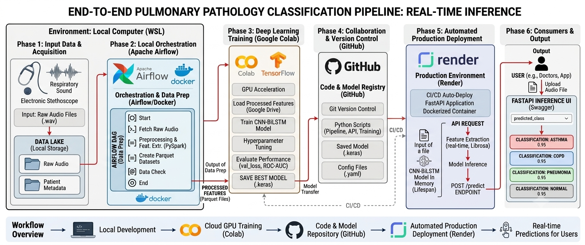
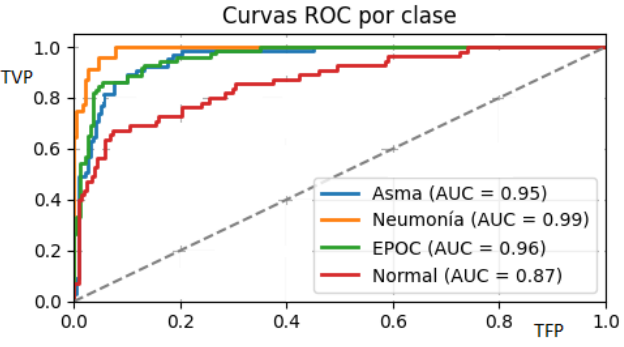
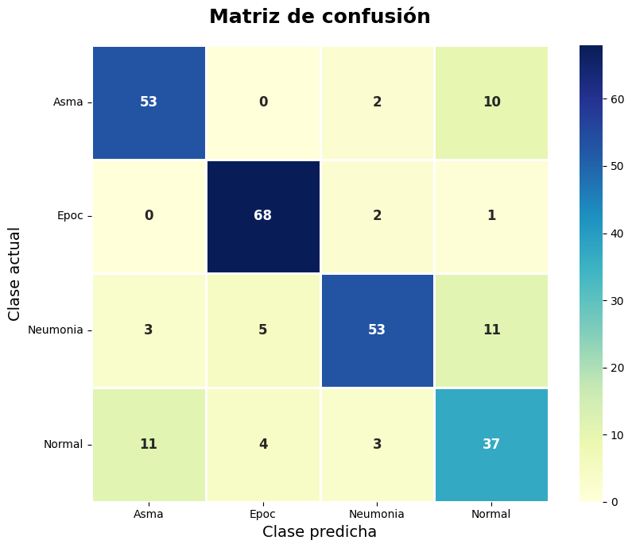

# Pipeline End-to-End de IA para la Detección Automática de Patologías Pulmonares mediante Sonidos Respiratorios

> 🌐 **Language / Idioma:** [Read in English (Inglés)](./README.md) | Español

Este proyecto implementa una solución completa de Machine Learning y MLOps que automatiza el procesamiento distribuido de sonidos respiratorios, la extracción de características acústicas (MFCC) y la inferencia mediante una arquitectura híbrida CNN-BiLSTM para la clasificación automática de Asma, EPOC, Neumonía y condiciones respiratorias normales a partir de grabaciones obtenidas con estetoscopios electrónicos.

---


## 📸 Arquitectura General


*El sistema automatiza el ciclo completo (Ciclo de vida de los datos y del modelo) implementando principios de aislamiento de entornos, entrenamiento reproducible en la nube y despliegue continuo.*

---

## 🎯 Objetivo

Desarrollar una plataforma End-to-End capaz de automatizar el procesamiento de sonidos respiratorios y asistir en la detección temprana de patologías pulmonares mediante técnicas de Inteligencia Artificial y MLOps.

---
## ⚙️ Flujo del Pipeline End-to-End

El sistema automatiza el ciclo completo de procesamiento de sonidos respiratorios, mapeando el flujo desde la adquisición de la señal hasta la inferencia en producción:

1. **Adquisición de datos e Ingesta:** Carga de registros fonomecánicos pulmonares integrando múltiples bases de datos clínicas internacionales.
2. **Procesamiento Distribuido:** Remuestreo (16kHz), filtrado de ruido (*Denoise*) y segmentación de señales acústicas optimizadas a gran escala mediante **PySpark**.
3. **Ingeniería de características:** Conversión de señales en representaciones numéricas mediante la extracción de Coeficientes Cepstrales en las Frecuencias de Mel (**MFCC**).
4. **Almacenamiento de datos:** Persistencia de vectores de características e información estructurada utilizando formatos eficientes de nivel analítico (**Parquet** y **JSON**).
5. **IA, entrenamiento del modelo:** Entrenamiento reproducible de una arquitectura híbrida avanzada (**CNN + BiLSTM**) utilizando **Google Colab (GPU)**, aplicando balanceo y normalización de clases y técnicas estrictas de prevención de *Data Leakage* (`GroupShuffleSplit`).
6. **Evaluación del modelo:** Cálculo automático de Accuracy, Precision, Recall, F1-Score, Matriz de Confusión, Curvas ROC-AUC.
7. **Registro y seguimiento de modelos:** Versionado del código fuente y artefactos mediante **Git y GitHub**. Almacenamiento del modelo final entrenado (`.keras`).
8. **Producción y Despliegue:** Exposición de endpoints optimizados mediante **FastAPI**, aislamiento del entorno con **Docker** y despliegue productivo en la nube a través de **Render**.
9. **Orquestación:** Automatización y monitoreo de todo el flujo de tareas (DAGs) mediante **Apache Airflow**.
---

## 🛡️ Características de Ingeniería y MLOps

* **Calidad de Datos:** Prevención estricta de *Data Leakage* mediante particionado por archivo de origen utilizando `GroupShuffleSplit`. Aislamiento completo entre conjuntos de entrenamiento, validación y prueba.  Balanceo automático de clases para reducir sesgos en patologías subrepresentadas.

* **Reproducibilidad:** Configuración centralizada mediante archivos de *settings* y variables de entorno. Pipeline determinístico utilizando semillas controladas (*random seeds*). Versionado de código, configuraciones y artefactos del modelo mediante Git y GitHub.

* **Escalabilidad:** Procesamiento distribuido de señales respiratorias mediante PySpark. Arquitectura modular desacoplada para facilitar mantenimiento y extensión. Persistencia eficiente utilizando formatos analíticos Parquet y JSON.

* **Producción:** API REST desarrollada con FastAPI para inferencia en tiempo real. Carga optimizada del modelo mediante ciclo de vida (*lifespan*) para minimizar latencia. Contenerización completa utilizando Docker. Despliegue automatizado en la nube mediante Render.

* **Orquestación y Automatización** Automatización integral del pipeline mediante Apache Airflow. Ejecución reproducible de procesos ETL, entrenamiento y evaluación. Generación automática de métricas, reportes y artefactos del modelo.

---

## 🛠️ Tecnologías Utilizadas

| Área | Tecnologías / Herramientas |
| :--- | :--- |
| **🧠 Machine Learning e IA** | TensorFlow, Keras, Scikit-Learn, NumPy, Pandas |
| **🎵 Procesamiento de Audio** | Librosa, SoundFile |
| **⚙️ Ingeniería de Datos y Orquestación** | Apache Airflow, Apache Spark (PySpark), Parquet, JSON |
| **⚡ Backend y API** | FastAPI, Uvicorn, Postman |
| **🐳 MLOps y Despliegue** | Docker, Git, GitHub, Render |
| **🧪 Testing y Calidad** | Pytest, Logging, Caplog |
| **📊 Visualización** | Matplotlib, Seaborn |


---
## 📂 Estructura del Proyecto
```text
.end-to-end-pipeline-audio-IA
├── airflow/           # Orquestación de tareas y definición de DAGs
├── api/               # Código base de la API REST (FastAPI)
├── config/            # Archivos de configuración y entornos (.env)
├── data/              # Data Lake Local (Estructura de almacenamiento)
├── ml/                # Pipeline de Machine Learning
│   ├── training/      # Scripts de entrenamiento y optimización
│   ├── evaluation/    # Reportes de performance
│   ├── artifacts/     # Pesos de los modelos entrenados (.keras)
│   └── reports/       # Gráficos y curvas analíticas (arq.png)
├── notebooks/         # Espacios de experimentación y EDA
├── tests/             # Pruebas unitarias y de integración
├── Dockerfile         # Configuración del contenedor de producción
├── requirements/      # Dependencias desacopladas por módulo
└── README.md

```
---
## Resultados

| Métrica | Valor |
| :--- | :---: |
| **Exactitud (Accuracy)** | 80.23 % |
| **Precisión (Precision)** | 0.80 |
| **Sensibilidad (Recall)** | 0.80 |
| **Puntuación F1 (F1-Score)** | 0.79 |
| **ROC-AUC Macro** | 0.94 |


<div align="left">  
  
</div>

<div align="left">  
  
</div>

---

## 🗃️ Datasets Utilizados

El modelo fue entrenado, validado y evaluado utilizando una base consolidada construida a partir de tres repositorios clínicos internacionales utilizados en investigación biomédica, con anotaciones y validaciones realizadas por especialistas.

### ICBHI 2017 Respiratory Sound Database

* Dataset de referencia recopilado de forma independiente por el laboratorio Lab3R de la Universidad de Aveiro (Portugal), el Hospital Infante D. Pedro (Portugal), la Universidad Aristóteles de Tesalónica (Grecia) y la Universidad de Coímbra (Portugal).
* **920 grabaciones** provenientes de **126 pacientes**.
* Etiquetas clínicas validadas por neumólogos expertos.

### Annotated Lung Sounds Dataset (ALSD)

* Desarrollado por la Universidad de Ciencia y Tecnología de Jordania en colaboración con el Hospital Universitario King Abdullah.
* **340 grabaciones** correspondientes a **112 sujetos**.
* Incluye registros normales y múltiples patologías respiratorias.

### Pulmonary (Lungs) Sound Dataset

* Recopilado por el Hospital Fortis (Nueva Delhi, India).
* **676 grabaciones respiratorias** clasificadas por profesionales de la salud.
* Contiene diversas condiciones pulmonares, incluyendo asma, EPOC y neumonía.

### 📊 Resumen del Dataset Consolidado

| Dataset                 | Grabaciones | Pacientes/Sujetos |
| ----------------------- | ----------: | ----------------: |
| ICBHI 2017              |         920 |               126 |
| ALSD                    |         340 |               112 |
| Pulmonary (Lungs) Sound |         676 |               N/D |
| **Total**               |   **1.936** |          **238+** |

La integración de estas fuentes permitió construir un conjunto de datos más diverso y representativo, mejorando la capacidad de generalización del modelo para la clasificación automática de **Asma, EPOC, Neumonía y sonidos respiratorios normales**.


---
## 🧪 ¡Probalo en Producción! (Audios de Prueba)

Podés interactuar directamente con el modelo desplegado utilizando la interfaz interactiva Swagger UI:

🔗 Enlace de la API: [API Render](https://end-to-end-pipeline-audio-ia.onrender.com/docs). 

**📥 Paso 1: Descargá un Audio de Prueba**

Descargá a tu computadora cualquiera de estas muestras reales para enviarlas a la API:

| Patología Real | Enlace de Descarga de Prueba | Estado Esperado de la API |
| :--- | :--- | :--- |
| **Asma** | [📥 Descargar Audio de Prueba](./ml/examples/Asthma.wav) | `Clasificación: Asma` |
| **EPOC** | [📥 Descargar Audio de Prueba](./ml/examples/Copd.wav) | `Clasificación: EPOC` |
| **Neumonía** | [📥 Descargar Audio de Prueba](./ml/examples/Pneumonia.wav) | `Clasificación: Neumonía` |
| **Normal** | [📥 Descargar Audio de Prueba](./ml/examples/Normal.wav) | `Clasificación: Normal` |


**🚀 Paso 2: Guía de Inferencia en la Interfaz (Swagger)**

    ⏳ Nota de Inicio Técnico (Cold Start): La aplicación se encuentra desplegada en el plan gratuito de Render, si la página inicial se muestra oscura o tarda en cargar, esperá entre 30 a 60 segundos sin refrescar para que el servicio se reactive.

Una vez que visualices la interfaz interactiva de FastAPI, seguí estos pasos:

1. Buscá el endpoint con etiqueta verde POST /predict y hacé clic sobre él para desplegarlo.

2. Hacé clic en el botón Try it out (ubicado arriba a la derecha del panel desplegado).

3. En el campo de carga de archivos (file), hacé clic en Seleccionar archivo y subí el audio .wav que descargaste en el Paso 1.

4. Presioná el botón azul grande Execute.


**📄 Ejemplo de Respuesta de la API**

Tras procesar el audio en tiempo real extrayendo los MFCCs e inyectándolos en la red neuronal CNN-BiLSTM, la API te devolverá un estado 200 con este formato:

```
{
  "status": "success",
  "filename": "107_2b4_Pr_mc_AKGC417L.wav",
  "prediction": "Epoc",
  "confidence": "99.93%"
}
```


