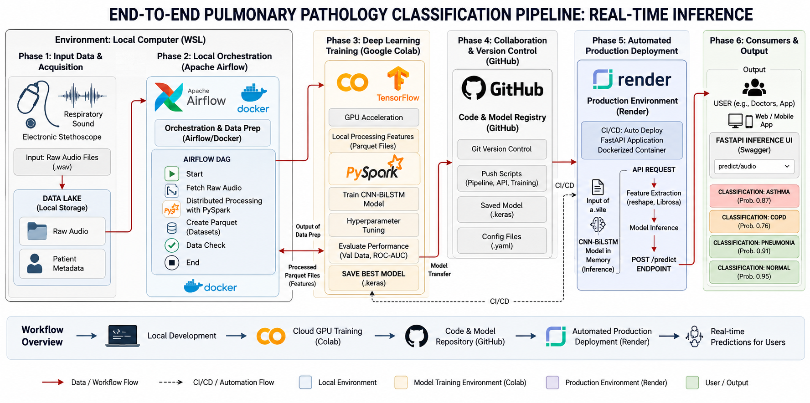
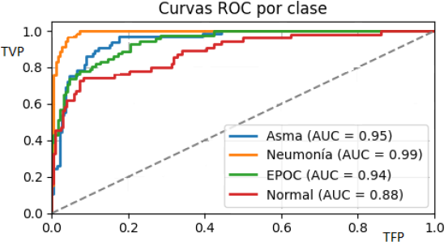
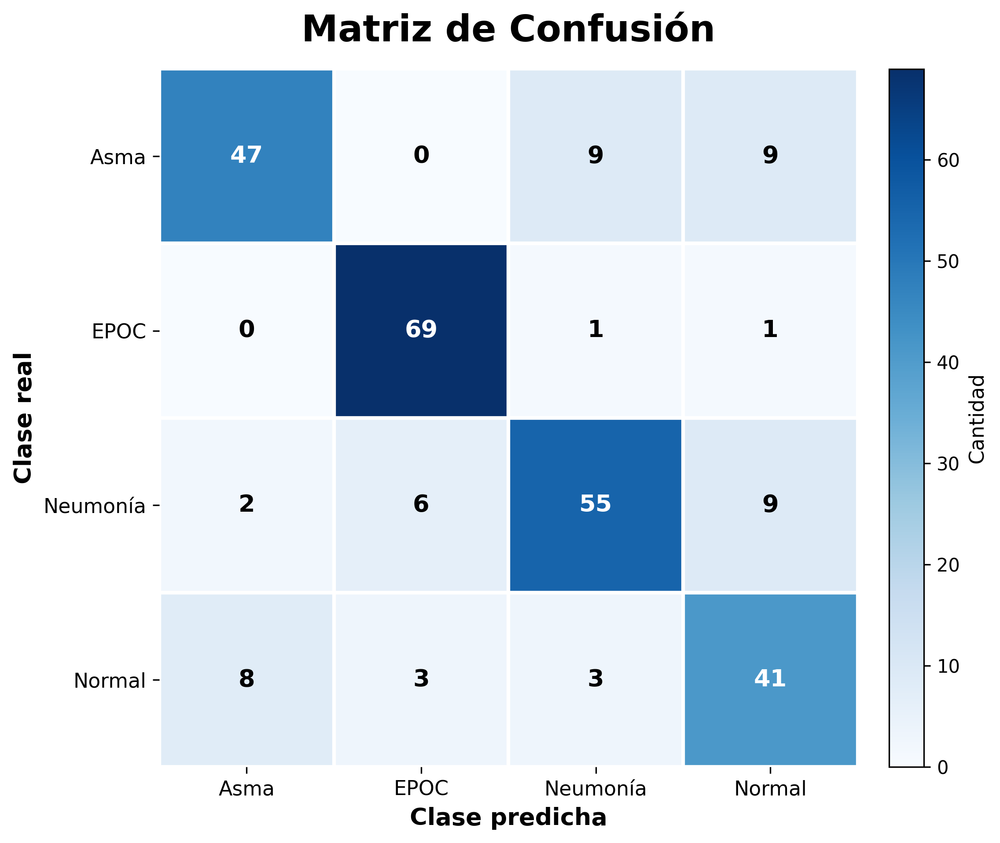

# # End-to-End Data Engineering, Machine Learning and MLOps Pipeline for Automatic Pulmonary Disease Diagnosis from Respiratory Sounds

> 🌐 **Language / Idioma:** [Read in Spanish (Español)](./README.es.md) | English

This project implements a comprehensive Data Engineering, Machine Learning, and MLOps solution for the automatic diagnosis of pulmonary diseases from respiratory sounds.

A reproducible End-to-End pipeline was developed to automate data ingestion, distributed signal preprocessing, MFCC feature extraction, dataset generation, model training, and evaluation across four Deep Learning architectures (LSTM, BiLSTM, CNN-LSTM, and CNN-BiLSTM).

Among them, the CNN-LSTM architecture achieved the best overall performance and was deployed to production using FastAPI, Docker, and Render for real-time inference.

---


## 📸 Overall Architecture


*The architecture summarizes the implemented End-to-End pipeline, integrating Data Engineering, Machine Learning, and MLOps into a unified End-to-End workflow from respiratory sound acquisition to deploying the CNN-LSTM model in production using FastAPI, Docker, and Render.*

---
## 🎬 Demo


---

## 🎯 Objetivo

Develop an End-to-End platform that automates distributed respiratory sound processing, acoustic feature extraction, and the automatic diagnosis of pulmonary diseases using Data Engineer, Artificial Intelligence and MLOps.

---

## ✨ Características

- Reproducible End-to-End Pipeline.
- Distributed preprocessing powered by PySpark.
- Automated MFCC feature extraction.
- Training and evaluation of four Deep Learning architectures: CNN, BiLSTM, CNN-LSTM, and CNN-BiLSTM.
- Fully orchestrated pipeline with Apache Airflow.
- REST API developed with FastAPI.
- Complete containerization using Docker.
- Cloud deployment on Render.
- Automated testing with Pytest.

---

## ⚙️ Flujo del Pipeline End-to-End

The system automates the entire respiratory sound processing lifecycle, mapping the workflow from signal acquisition to production inference:

1. **Data Acquisition and Ingestion:** Ingestion of respiratory sound recordings collected from multiple international clinical datasets. 
2. **Distributed Preprocessing:** Scalable noise filtering (*denoising*) and segmentation of acoustic signals optimized at a large scale using **PySpark**.
3. **Advanced Feature Engineering:** Conversion of raw audio signals into numerical representations through Mel-Frequency Cepstral Coefficients (MFCC) extraction. This process runs under the following mathematical and filtering sequence:
   - **Pre-emphasis:** Application of a high-pass filter to compensate for the natural attenuation of high-frequency components in the human respiratory tract.
   - **Windowing:** Segmentation using 25 ms *Hamming* windows with a 25% overlap to ensure the stationarity of the short-term audio signal without losing temporal continuity.
   - **Frequency Analysis (FFT):** Calculation of the Fast Fourier Transform to map the power spectrum of the signal.
   - **Mel Filter Bank:** Logarithmic mapping using triangular transfer functions spaced along the Mel scale to mimic non-linear human auditory perception.
   - **Discrete Cosine Transform (DCT):** Decorrelation of coefficients to obtain the final MFCCs, discarding high-variability noise components.
4. **Data Storage:** Persistence of feature vectors and structured metadata using analytical-grade formats (**Parquet** and **JSON**).
5. **Candidate Model Training:** Reproducible training of multiple advanced deep learning architectures (**CNN, BiLSTM, CNN-LSTM, and CNN-BiLSTM**) using **Google Colab (GPU)**. The workflow incorporated class balancing, normalization, and **Data Leakage** prevention via GroupShuffleSplit, as well as regularization techniques like **Early Stopping** to halt training when validation performance stopped improving, mitigating overfitting risks. 
6. **Evaluation and Selection:** Automated calculation of comparative metrics (Accuracy, Precision, Recall, F1-Score, ROC-AUC curves, and Confusion Matrices) to select the model with the best overall performance.
7. **Model Registry and Versioning:** Version control of source code and artifacts using Git and GitHub. Optimized storage of the selected final model (`.keras`).
8. **Production and Deployment:** Exposure of optimized endpoints for real-time inference using **FastAPI**, absolute environment isolation using **Docker**, and continuous deployment (CD) to the cloud via **Render**.
9. **Orchestration and Automation:** End-to-end automation and monitoring of the task workflow and DAG dependencies using **Apache Airflow**.


---

## 🛡️ Engineering and MLOps Best Practices

* **Data Quality:** mplementation of a robust pipeline that prevents Data Leakage through `GroupShuffleSplit`, ensures complete isolation between train/validation/test sets, normalizes features to improve training stability, and automatically balances classes to mitigate imbalances in underrepresented pathologies.

* **Reproducibility:** Centralized configuration managed via *settings* files and environment variables. Code, configurations, and model artifacts are fully versioned using Git and GitHub.

* **Scalability:** Distributed processing of respiratory signals using PySpark. Decoupled modular architecture for easy maintenance and extensibility. Efficient data persistence leveraging analytical Parquet and JSON formats.

* **Production-Ready:** REST API developed with FastAPI for low-latency, real-time inference. Optimized model loading utilizing a startup *lifespan* event handler to minimize response latency. Complete containerization using Docker. Automated cloud deployment via Render.

* **Orchestration and Automation** Complete pipeline automation using Apache Airflow. Reproducible execution of ETL, training, and evaluation processes. Automatic generation of metrics, reports, and model artifacts.

---
## 🏗️ Applied Software Engineering

During development, the following software engineering and MLOps practices were strictly applied:

- Modular software architecture.
- Clean decoupling between training and inference pipelines.
- Configuration management via environment variables.
- Logging.
- Unit and integration testing.
- Docker.
- Reproducible pipeline design.
- Workflow orchestration with Airflow.
- Persistence in Parquet formats.

---

## 🛠️ Tech Stack

| Domain | Technologies / Tools |
| :--- | :--- |
| **🧠 Machine Learning & IA** | TensorFlow, Keras, Scikit-Learn, NumPy, Pandas |
| **🎵 Audio Processing** | Librosa, SoundFile |
| **⚙️ Data Engineering & Orchestration** | Apache Airflow, Apache Spark (PySpark), Parquet, JSON |
| **⚡ Backend & API** | FastAPI, Uvicorn, Postman |
| **🐳 MLOps & Deployment** | Docker, Git, GitHub, Render |
| **🧪 Testing & QA** | Pytest, Logging, Caplog |
| **📊 Visualization** | Matplotlib, Seaborn |

---
## 📂 Project Structure

```text
.end-to-end-pipeline-audio-IA
├── airflow/                # DAGs and pipeline orchestration
├── api/                    # REST API codebase developed with FastAPI
├── config/                 # Centralized configuration setup
├── docker/                 # Independent Dockerfiles for each service                    
│   ├── airflow.Dockerfile  # Pipeline orchestration service environment
│   ├── api.Dockerfile      # FastAPI production serving & local testing container
│   ├── etl.Dockerfile      # Distributed audio processing container with PySpark
│   └── training.Dockerfile # Isolated container for ML training and evaluation
├── etl/                    # ETL pipeline for distributed audio processing
│   ├── ingest.py           # Audio and metadata ingestion scripts
│   ├── mfcc_pyspark.py     # Distributed MFCC feature extraction using PySpark
│   ├── save_parquet.py     # Dataset persistence in analytical Parquet format
│   └── segment.py          # Respiratory signal segmentation logic
├── images/                 # Graphical assets and diagrams used across the README
├── ml/                     # Machine Learning pipeline and workflows (MLOps)
│   ├── artifacts/          # Trained model files and generated binary artifacts
│   ├── evaluation/         # Model performance evaluation suite
│   ├── examples/           # Audio samples for testing the live deployed model
│   ├── reports/            # Evaluation metric reports and generated plots
│   └── training/           # Deep Learning architecture training scripts
├── notebooks/              # R&D exploratory analysis and experimentation notebooks
├── requirements/           # Isolated dependency manifests for each microservice
├── .gitignore
├── docker-compose.yml      # Multi-container orchestration configurations
├── LICENSE                 # Project's MIT License file
├── main.py                 # Main application entry point
├── pytest.ini              # Pytest automation and testing configuration
├── README.es.md            # Project documentation in Spanish
└── README.md               # Main project documentation in English
```

---

### 🏗️ Architecture Overview

| Layer | Directory | Responsibility |
|-------|-----------|----------------|
| Workflow Orchestration | `airflow/` | DAGs that orchestrate ETL, model training and evaluation. |
| Data Engineering | `etl/` | Data ingestion, preprocessing, segmentation and distributed MFCC extraction with PySpark. |
| Machine Learning | `ml/` | Model training, evaluation, reports and artifacts. |
| Model Serving | `api/` | REST API for real-time inference using FastAPI. |
| Infrastructure | `docker/` | Dockerfiles and containerization of all services. |
| Configuration | `config/` | Centralized configuration using YAML files. |
| Quality Assurance | `tests/` | Automated testing with Pytest. |

---
### 🏗️ Architecture Overview

The project follows a modular layered architecture, separating responsibilities into orchestration, data engineering, machine learning, model serving, infrastructure and quality assurance.

| Layer | Directory | Responsibility |
|-------|-----------|----------------|
| Workflow Orchestration | `airflow/` | DAGs that orchestrate ETL, model training and evaluation. |
| Data Engineering | `etl/` | Data ingestion, preprocessing, segmentation and distributed MFCC extraction with PySpark. |
| Machine Learning | `ml/` | Model training, evaluation, reports and artifacts. |
| Model Serving | `api/` | Exposes the trained model through a FastAPI REST API for real-time inference. |
| Infrastructure | `docker/` | Dockerfiles and containerization of all services. |
| Configuration | `config/` | Centralized configuration using YAML files. |
| Quality Assurance | `tests/` | Automated testing with Pytest. ||

---

## ☁️ Production Deployment

The platform is deployed on Render using Docker containers and a FastAPI REST API to provide real-time inference.

---

## 🧠 Experimentation and Evaluated Architectures

As part of the research and development for the Engineering Thesis, four Deep Learning architectures were designed, trained, and exhaustively compared under the exact same experimental protocol to determine the optimal approach for bioacoustic respiratory signal classification:

1. **CNN (Convolutional Neural Network):** Designed to act as an automatic, high-level spatial feature extractor directly from the MFCC coefficient matrices.
2. **BLSTM (Bidirectional Long Short-Term Memory):** Focused purely on modeling long-term sequential dependencies, analyzing temporal context in both forward and backward directions.
3. **CNN-LSTM (Sequential Hybrid):** A combined approach where the CNN extracts spatial feature maps, and a conventional LSTM layer processes their temporal evolution unidirectionally.
4. **CNN-BiLSTM (Bidirectional Hybrid):** Integrates robust convolutional blocks (`Conv2D`, `MaxPooling2D`) coupled with bidirectional recurrent layers (`Bidirectional(LSTM)`), capturing both spectral morphology and the complete sequential context (past and future) of the respiratory cycle.

> 🚀 **Production Deployment Note:** After a rigorous analysis of metrics, the hybrid **CNN-LSTM** architecture was selected for final production deployment on **Render** due to its consistency, superior generalization capabilities against acoustic noise, and overall solid evaluation metrics.

---

## 📊 Evaluation & Model Selection 

To determine the optimal architecture, all four deep neural network variants were evaluated under the same PySpark preprocessing pipeline and training protocol.

To guarantee statistical reliability and mitigate *overfitting*, a *Hold-Out* splitting strategy (70% train, 15% val, 15% test) combined with *Early Stopping* was applied.

### Performance Comparison Table

| Evaluated Architecture | Accuracy | Precision | Recall | F1-Score | ROC-AUC Macro | Pipeline Status / Deployment |
| :--- | :---: | :---: | :---: | :---: | :---: | :--- |
| **🧠 CNN-LSTM** | **81 %** | **0.8** | **0.8** | **0.8** | **0.94** | 🟢 **Selected and Displayed (Render)**  |
| **🧠 CNN-BiLSTM** | *80.23 %* | *0.80* | *0.80* | *0.79* | *0.94* | 🟡 Evaluated in Thesis Phase |
| **🧠 CNN** | *80.23 %* | *0.8* | *0.79* | *0.79* | *0.93* | 🟡 Evaluated in Thesis Phase |
| **🧠 BiLSTM** | *68 %* | *0.68* | *0.68* | *0.67* | *0.88* | 🟡 Evaluated in Thesis Phase |

> 📑 **Engineering Note:** *Although four architectures were implemented and evaluated under the same experimental protocol, the CNN-LSTM architecture achieved the best overall performance regarding spatial feature extraction and temporal alignment. Consequently, it was selected as the final production model currently running on Render.*

### Analytical Curves of the Selected Model

<div align="left">  
  
  <p><i>ROC-AUC Macro Curve of the Production Model (CNN-LSTM).</i></p>
</div>

<div align="left">  
  
  <p><i>Confusion matrix resulting from the production model (CNN-LSTM).</i></p>
</div>

---

## 🗃️ Datasets and Data Acquisition

The model was trained, validated, and evaluated using a consolidated dataset of three public respiratory sound databases widely used in biomedical research. The recordings were obtained in international hospitals and research centers and feature clinical annotations verified by medical specialists. Together, these sources provide a robust foundation for Artificial Intelligence modeling, offering clinically reliable, technically consistent, and open data for scientific research.


### 🌐 1. ICBHI 2017 Respiratory Sound Database
* **Origin:** Compiled independently by the Lab3R laboratory of the [University of Aveiro (Portugal)](https://www.ua.pt/pt/essua) (in association with the Hospital Infante D. Pedro), the Aristotle [Aristotle University of Thessaloniki (Greece)](https://www.auth.gr/) (Hospital Papanikolaou), and the [University of Coimbra (Portugal)](https://www.uc.pt/en/).
* **Validation:** Clinical labels validated by expert pulmonologists within the framework of the international ICBHI scientific challenge.
* **Official Link:** [ICBHI Challenge Site 2017](https://bhichallenge.med.auth.gr/)

### 🌐 2. Annotated Lung Sounds Dataset (ALSD-Net)
* **Origin:** Developed by the [Jordan University of Science and Technology](https://www.just.edu.jo/Pages/Default.aspx) in direct collaboration with the King Abdullah University Hospital.
* **Capture Hardware:**. Pulmonary phonomechanical recordings captured via a **3M Littmann electronic stethoscope model 3200** placed in various anatomical positions on the chest wall.
* Covers age ranges from 21 to 90 years.
* **Official Link:** [ALSD on Mendeley Data](https://data.mendeley.com/datasets/jwyy9np4gv/3)

### 🌐 3. Pulmonary (Lungs) Sound Dataset
* **Origen:** .Collected and classified by professional physicians at the [Hospital Fortis](https://www.fortishealthcare.com/location/fortis-flt-lt-rajan-dhall-hospital-vasant-kunj) in New Delhi, India.
* **Technical Specification:** Recordings were made using an electronic stethoscope connected to a laptop through a signal amplifier. The physical system was specifically configured to **amplify the critical frequency range between 70 Hz and 2000 Hz**, ensuring precise capture of acoustic respiratory phenomena.
* **Official Link:** [Pulmonary Sound on Mendeley Data](https://data.mendeley.com/datasets/fr7zvy8j5s/1)

---

## 📊 Statistical Summary of the Consolidated Dataset

The integration and standardization of the **three international public databases** allowed the construction of a consolidated set of **1,247 recordings** representing **more than 238 patients**, providing a highly diverse and representative sample for training, validating, and evaluating classification models for **Asthma, COPD, Pneumonia, and Normal condition**.

| Dataset                     | Recordings | Patients/Subjects | Acquisition Method                            |
| :-------------------------- | :---------: | :---------------: | :----------------------------------------------- |
| **ICBHI 2017**              |     866     |        126        | Electronic Stethoscope                         |
| **ALSD-Net**                |     137     |        112        | Electronic Stethoscope                         |
| **Pulmonary (Lungs) Sound** |     244     |       *N/D*       | Electronic stethoscope and microphone             |
| **Consolidated total**       |  **1.247**  |      **238+**     | **Classification: Asthma, COPD, Pneumonia and Normal** |

> 🛡️ Data Quality & Data Leakage Prevention: The recording counts correspond to the consolidated subset of audio files curated for this project, not the original size of each individual dataset. Only the **Asthma, COPD, Pneumonia, and Normal** classes were preserved, filtering out other pathologies. Subsequently, audios were processed through a uniform pipeline that included **quality filtering, segmentation with 25% overlap, MFCC coefficient extraction, normalization, and class balancing**. Each segment retained an identifier of its source recording, allowing partitioning via **GroupShuffleSplit**. This guaranteed that all segments derived from a single recording remained in the same set (train, validation, or test), strictly preventing **Data Leakage**.

---

# 🧪 Try the Live API in Production!

**📥 Step 1: Download a Sample Audio File**

Download any of these real patient audio samples to your computer to send to the live API:

| Actual Pathology | Download Link | Expected API Classification |
| :--- | :--- | :--- |
| **Asthma** | [📥 Download Sample Audio](./ml/examples/Asthma.wav) | `Classification: Asthma` |
| **COPD** | [📥 Download Sample Audio](./ml/examples/Copd.wav) | `Classification: COPD` |
| **Pneumonia** | [📥 Download Sample Audio](./ml/examples/Pneumonia.wav) | `Classification: Pneumonia` |
| **Normal** | [📥 Download Sample Audio](./ml/examples/Normal.wav) | `Classification: Normal` |

⚠️ **Want to test with your own audio recordings?**

To obtain results comparable to those of the model's training phase, your recordings must meet the following technical conditions:
* **Hardware:** Recorded exclusively using an electronic stethoscope.
* **Sampling Rate:** Minimum of 44.1 kHz.
* **Duration:** No less than 3 seconds (to capture at least one full respiratory cycle) and no more than 10 seconds (to maintain efficient processing and low-latency inference).

---

**🚀 Step 2: Query the Live API on Render**

> ⏳ **Technical Note (Cold Start):** The application is deployed on Render's free tier. If the initial page takes some time to load, please wait 30 to 60 seconds without refreshing so the container can spin up from its idle state.

Access the API deployed on Render, whose interactive documentation is powered by Swagger UI:

🔗 API Link: [API en Render](https://end-to-end-pipeline-audio-ia.onrender.com/docs).

Once you see the interactive FastAPI Swagger UI, follow these steps:

1. Locate the endpoint with the green label **POST `/predict`** and click to expand it
2. Click the **Try it out** button (located on the top right of the expanded panel).
3. In the file upload field (`file`), click **Choose File...** and upload the .wav audio file you downloaded in Step 1.
4. Click the large blue horizontal **Execute** button

---

**📄 Example API Response**

After receiving the audio, the API automatically executes the processing pipeline (quality filtering, segmentation, MFCC extraction, and inference via the **CNN-LSTM** neural network). It returns an HTTP 200 OK response with a JSON object containing the execution status, the processed filename, the predicted class, and its confidence score:

```json
{
  "status": "success",
  "filename": "107_2b4_Pr_mc_AKGC417L.wav",
  "prediction": "EPOC",
  "confidence": "99.93%"
}
```

--- 

## 🎓 Final Engineering Thesis & MLOps Initiative

This project originated as the **Final Graduation Thesis (Trabajo Final)** to obtain the **Computer Engineering Degree** from the **School of Engineering at the National University of Jujuy (FI-UNJu)**. The scientific research and development of the AI core were conducted under the direction and support of the **GeoTechnologies and Image Sciences Laboratory (FI-UNJu)**. The Thesis was defended, obtaining the maximum grade of **10/10**.

The research focused on the design, training, and validation of Deep Learning models for the automatic classification of Asthma, Pneumonia, COPD, and Normal pulmonary conditions using respiratory acoustic signals.

Following the successful thesis defense, the project evolved into a personal initiative to transform the research prototype into a production-grade End-to-End platform, incorporating software engineering, distributed systems, and MLOps best practices.

The main improvements implemented include:

* 🚀 Exposing the model via a REST API developed with FastAPI and automated OpenAPI/Swagger documentation.
* 🔄 Automating the data, training, and evaluation pipelines using **Apache Airflow**.
* ⚡ Distributed preprocessing of bioacoustic signals using **PySpark**.
* 🐳 Complete platform containerization using Docker, ensuring portability and reproducibility.
* ☁️ Continuous deployment (CD) to the cloud via Render to enable real-time inferences.

---
## 📝 Publications & Academic Contributions

The methodology, rigor, and validations applied in this project were peer-reviewed, approved, and presented at prestigious computer science conferences:

1. **Tolaba, N. I., & Sarmiento, G. N. R. (2025).** “Identificación Inteligente de Enfermedades Pulmonares en Audios Respiratorios”. XXVII Argentine Congress of Computer Science (**CACIC 2025**). National University of Jujuy.
2. **Tolaba, N. I., et al. (2025).** *“Deep Learning aplicado a la identificación de cantos de anuncio de Boana riojana (Amphibia: Anura)”*. XXVI Workshop of Researchers in Computer Science (**WICC 2025**). *Note: Successful validation of the cross-species adaptability and robustness of the developed hybrid architectures on bioacoustic signals of native amphibians.*

---
## ⚠️ Limitations

* This system is designed to be an auxiliary screening tool and **does not replace professional medical diagnosis**.
* The model was trained and evaluated on **public datasets** curated for research; its performance in other clinical environments may vary.
* Diagnostic accuracy may be affected by differences in capture hardware, ambient noise, and microphone placement.
* The number of recordings available for certain pathologies is limited. Incorporating a larger volume and diversity of clinical records would improve the model's generalization capabilities and potentially increase its performance metrics.

---

## 🔮 Future Work

* **Local Clinical Validation:** Evaluate the trained models using clinical records and controlled acoustic conditions of patients in regional hospital environments.

* **Dataset Expansion:** Incorporate new recordings from different healthcare institutions to increase patient diversity, capture devices, and clinical settings. A larger volume and variety of data will improve the model's generalization capabilities.

* **Mobile Device Optimization:** Export the model to lightweight formats like TensorFlow Lite (`.tflite`) or **ONNX** to enable offline, on-device inference for Android and iOS applications.

* **Point-of-Care Assistance:** Integrate the platform with digital stethoscopes and telemedicine solutions to support diagnostic screenings in primary care centers and areas with limited access to specialists.

---

## 📄 License

This project is licensed under the MIT License - see the [LICENSE](LICENSE) file for details.

